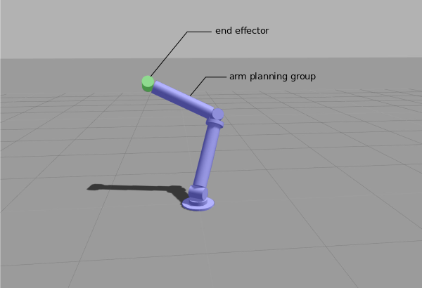

# ros-robotic-arm

This package is meant to help me understand how to use [MoveIt!](https://moveit.ros.org/) to control a robotic arm inside Gazebo. 

## Prerequsities

To use this package you need to instal 
- [ROS](http://www.ros.org/) 
- [Gazebo](http://gazebosim.org/) and 
- [MoveIt!](https://moveit.ros.org/) framework. 

## Robotic arm description

This package contains a simple robotic arm consisting of two arms and a end effector link as can be seen on the picture bellow. 



The MoveIt! planning is now using a IKFast plugin of type TranslationDirection5D generated by following [this tutorial](http://docs.ros.org/indigo/api/moveit_tutorials/html/doc/pr2_tutorials/kinematics/src/doc/kinematics_configuration.html). It makes the planning faster. The solver can be changed in `robotic_arm_moveit_config/config/kinematics.yaml` file. (change this line: `kinematics_solver: robotic_arm_arm_kinematics/IKFastKinematicsPlugin` for a solver of your choosing. For example `kinematics_solver: kdl_kinematics_plugin/KDLKinematicsPlugin`)

## Current State

### Control with Rviz
You can start the robotic arm in Gazebo using command.

     roslaunch robotic_arm_gazebo empty_world.launch 
  
You can run rviz and see planned trajectories between different positions of the robotic arm using command

     roslaunch robotic_arm_moveit_config moveit_planning_execution.launch

and adding the MotionPlanning display to the rviz inside the GUI.

You can set the starting and end positions and then click the 'plan and execute button' and the robotic arm will move to the end position both in Rviz and in the Gazebo.

### Control with Servis

You can set the individual joint position by calling a service. 

Launch Gazebo:

     roslaunch robotic_arm_gazebo empty_world.launch 

Launch MoveIt!:

     roslaunch robotic_arm_algorithm move.launch

Run service:

     rosrun robotic_arm_algorithms set_joint_states_service.py

Set joint states:

     rosrun robotic_arm_algorithms set_joint_states_client.py <base_forearm_joint_angle> <forearm_0_1_joint_angle> <forearm_arm_joint_angle> <arm_0_1_joint_angle>

|joint                        |range              |
|:---------------------------:|:-----------------:|
|`<base_forearm_joint_angle>` | [-3e+307, 3e+307] |
|`<forearm_0_1_joint_angle>`  | [-1.4, 1.4]       |
|`<forearm_arm_joint_angle>`  | [-3e+307, 3e+307] |
|`<arm_0_1_joint_angle>`      | [-1.4, 1.4]       |

---

<!-- edit by nckmlb -->
modifications to get it (mostly) running!:
- edit the licenses for the following packages to whatever you'd like, as catkin_make gets angry when it's empty (I changed them all to MIT because those were the three easiest letters to remember)
  - robotic_arm_algorithms
  - robotic_arm_gazebo
  - robotic_arm_description
  - note: may include any additional package without a license entered. Error code appears as follows:
    - Error(s) in package '/path/to/PKG_NAME/package.xml': The license tag must neither be empty nor only contain whitespaces
- comment out the `add_message_files()` bit in the robotic_arm_algorithms CMakeLists.txt (idk why, but it's mad...possibly because it's not used?)
- Note: there will be a CMake Warning(1) and a bunch of catkin_make warnings(2) that I haven't figured out how to fix yet, but the code mostly works even without addressing them
- Note 2: slight chance there'll be warnings about missing models (wam_test, turtlebot3, sawyer, and baxter). Just ignore those as they are not used in this package.

(1)

```
CMake Warning at robotic_arm_ikfast_arm_plugin/CMakeLists.txt:30 (add_library):
  Cannot generate a safe runtime search path for target
  robotic_arm_arm_moveit_ikfast_plugin because there is a cycle in the
  constraint graph:

    dir 0 is [/opt/ros/noetic/lib]
      dir 1 must precede it due to runtime library [libsrdfdom.so]
    dir 1 is [/home/nckmlb/nuws/devel/lib]
      dir 0 must precede it due to runtime library [libmoveit_exceptions.so.1.1.0]

  Some of these libraries may not be found correctly.
```

(2) (just a sample...there are kind of a lot and they're all the same kind of warning/note pair)
```
/home/nckmlb/throwaway/src/robotic_arm_ikfast_arm_plugin/src/robotic_arm_arm_ikfast_moveit_plugin.cpp: In member function ‘virtual bool ikfast_kinematics_plugin::IKFastKinematicsPlugin::initialize(const string&, const string&, const string&, const string&, double)’:
/home/nckmlb/throwaway/src/robotic_arm_ikfast_arm_plugin/src/robotic_arm_arm_ikfast_moveit_plugin.cpp:343:86: warning: ‘virtual void kinematics::KinematicsBase::setValues(const string&, const string&, const string&, const string&, double)’ is deprecated [-Wdeprecated-declarations]
  343 |   setValues(robot_description, group_name, base_name, tip_name, search_discretization);
      |                                                                                      ^
In file included from /home/nckmlb/throwaway/src/robotic_arm_ikfast_arm_plugin/src/robotic_arm_arm_ikfast_moveit_plugin.cpp:50:
/opt/ros/noetic/include/moveit/kinematics_base/kinematics_base.h:344:31: note: declared here
  344 |   [[deprecated]] virtual void setValues(const std::string& robot_description, const std::string& group_name,
      |                               ^~~~~~~~~
```

---

NOTE: code currently works only for specific poses in MoveIt (included by creator); random poses will return the following error:

```

[ERROR] [1625239676.546806473, 282.281000000]: Planning pipeline threw an exception: Duration is out of dual 32-bit range
terminate called after throwing an instance of 'std::runtime_error'
  what():  Duration is out of dual 32-bit range
[move_group-1] process has died [pid 189422, exit code -6, cmd /home/nckmlb/nuws/devel/lib/moveit_ros_move_group/move_group --debug __name:=move_group __log:=/home/nckmlb/.ros/log/6916082a-db49-11eb-8dd5-7f18388da428/move_group-1.log].
log file: /home/nckmlb/.ros/log/6916082a-db49-11eb-8dd5-7f18388da428/move_group-1*.log

```

which is kind of weird since it does appear to begin planning anyway?

```

...
[ INFO] [1625239676.544445226, 282.279000000]: arm/arm: Starting planning with 1 states already in datastructure
[ INFO] [1625239676.544840399, 282.279000000]: arm/arm: Created 5 states (2 start + 3 goal)
[ INFO] [1625239676.544924476, 282.279000000]: arm/arm: Created 4 states (2 start + 2 goal)
[ INFO] [1625239676.545162899, 282.280000000]: ParallelPlan::solve(): Solution found by one or more threads in 0.000831 seconds
[ INFO] [1625239676.546300881, 282.280000000]: SimpleSetup: Path simplification took 0.001052 seconds and changed from 3 to 2 states
[ERROR] [1625239676.546806473, 282.281000000]: Planning pipeline threw an exception: Duration is out of dual 32-bit range

```

suspect it might have something to do with catkin_make not compiling clean enough. Anyway, controllers seem to be doing something right:

```

^C[rviz_xpso_189365_9190369134050991479-4] killing on exit
[state_publisher-3] killing on exit
[controller_spawner-2] killing on exit
[INFO] [1625240822.362141, 1424.400000]: Shutting down spawner. Stopping and unloading controllers...
[INFO] [1625240822.363526, 1424.401000]: Stopping all controllers...
[INFO] [1625240822.384439, 1424.422000]: Unloading all loaded controllers...
[INFO] [1625240822.385683, 1424.424000]: Trying to unload arm_position_controller
[INFO] [1625240822.417333, 1424.455000]: Succeeded in unloading arm_position_controller
[INFO] [1625240822.418735, 1424.456000]: Trying to unload joint_state_controller
[INFO] [1625240822.442684, 1424.479000]: Succeeded in unloading joint_state_controller
shutting down processing monitor...
... shutting down processing monitor complete
done

```

a work in progress